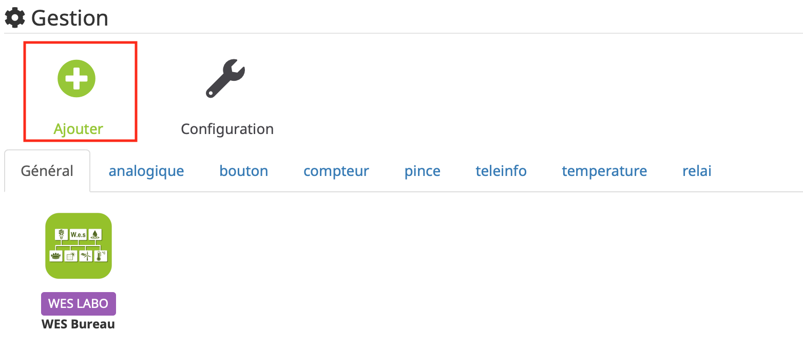

# Wes Plugin

Plugin zur Verwendung von WES von CartElectronics

# Konfiguration der Wes

Nach der Installation des Plugins müssen Sie es nur noch aktivieren :

**Konfiguration**

Um das Plugin zu konfigurieren, müssen Sie das Wes hinzufügen.

Wes hinzufügen : **Plugins** → **Hausautomationsprotokoll** → **Wes** → **Hinzufügen**

Hier sind die einzugebenden Parameter :

-   **Name Ihres WES** : Wes Name
-   **Aktivieren** : Wes Aktivierung
-   **Wes IP** : Informieren Sie die WES-Zugangs-IP
-   **Wes-Datei** : Sie müssen "allgemein" setzen, wenn es sich um eine Wes-Konfiguration handelt.
-   **Hafen von Wes** : Lassen Sie das Feld leer, wenn Sie dies in der Konfiguration des Wes nicht geändert haben.
-   **Wes Konto** : Geben Sie den Login des Wes-Kontos ein (ursprünglich ist es "Admin").
-   **Wes Passwort** : Geben Sie das Passwort des Wes-Kontos ein (ursprünglich ist es "wes"").

> **Spitze**
>
> Wenn Sie die Informationen ändern möchten, müssen Sie zuerst die WES-Schnittstelle aufrufen.

Nach dem Speichern erhalten Sie eine Vielzahl von Modulen. Sie müssen nur die gewünschten aktivieren.

> **Spitze**
>
> Die grau hinterlegten Module werden vom Plugin nicht überwacht, Sie müssen sie dafür aktivieren.

# Relaiskonfiguration

Nach der Initialisierung des Wes Plugins können Sie auf den unten stehenden Schlüssel klicken.

Durch Klicken auf diese Taste wird ein Modal angezeigt. Wählen Sie die Relais und die Schaltfläche aus und validieren Sie sie. Dies führt zu einem Szenario auf dem Wes, in dem Schaltflächen und Relais in Echtzeit zurückgemeldet werden (für andere Rückmeldungen müssen Sie die allgemeinen Einstellungen des Plugins aufrufen.)

