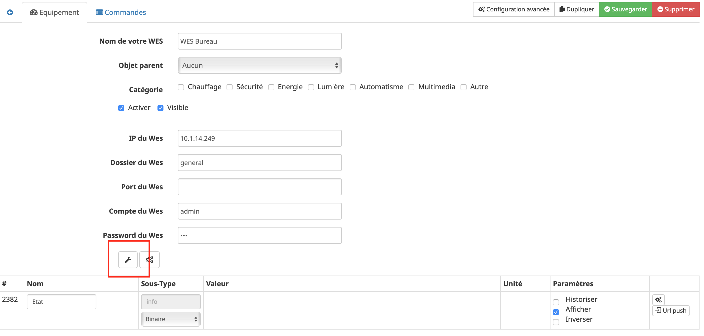

# Complemento Wes

Complemento para usar WES de CartElectronics

# Configuración del Wes

Después de instalar el complemento, solo necesita activarlo :

**Configuración**

Para configurar el complemento, debe agregar el Wes.

Para agregar un wes : **Plugins** → **Protocolo de domótica** → **Wes** → **Añadir**

Aquí están los parámetros para ingresar :

-   **Nombre de tu WES** : Nombre de Wes
-   **Activar** : Wes activación
-   **Wes IP** : informar a la IP de acceso WES
-   **Wes File** : tienes que poner "general" si es una configuración wes.
-   **Puerto de wes** : déjelo en blanco si no cambió esto en la configuración del Wes.
-   **Cuenta Wes** : poner el inicio de sesión de la cuenta de Wes (originalmente es "Admin").
-   **Wes contraseña** : poner la contraseña de la cuenta de Wes (originalmente es "wes").

> **Punta**
>
> Si desea cambiar su información, primero debe ir a la interfaz WES.

Después de guardar, obtendrá una multitud de módulos, solo necesita activar los que desea.

> **Punta**
>
> los módulos en gris no son monitoreados por el complemento, debe activarlos para eso.

# Configuración de relé

Después de la inicialización de Wes Plugin, puede hacer clic en la tecla, ver a continuación.

Al hacer clic en esta tecla se muestra un modal, seleccione los relés y el botón deseo y valide. lo que lleva a un escenario en el oeste para tener comentarios en tiempo real de botones y relés (para otros comentarios, debe ir a la configuración general del complemento.)

