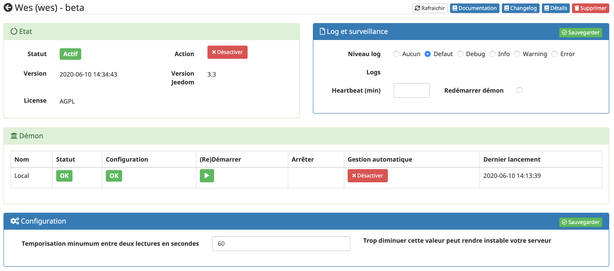

# Wes plugin

Plugin para usar WES da CartElectronics

# Configuração do Wes

Depois de instalar o plugin, você só precisa ativá-lo :

**Configuração**

Para configurar o plug-in, você deve adicionar o Wes.

Para adicionar um wes : **Plugins** → **Protocolo de automação residencial** → **Wes** → **Adicionar**

Aqui estão os parâmetros para inserir :

-   **Nome do seu WES** : Nome de Wes
-   **Ativar** : Ativação Wes
-   **Wes IP** : informe o ip de acesso WES
-   **Wes File** : você tem que colocar "geral" se for uma configuração wes.
-   **Porto de Wes** : deixe em branco se você não mudou isso na configuração do Wes.
-   **Wes conta** : coloque o login da conta Wes (originalmente é "Admin").
-   **Senha do Wes** : coloque a senha da conta Wes (originalmente é "wes").

> **Dica**
>
> Se você deseja alterar suas informações, você deve primeiro acessar a interface WES.

Depois de salvar, você terá uma infinidade de módulos, basta ativar os que deseja.

> **Dica**
>
> os módulos acinzentados não são monitorados pelo plug-in, você deve ativá-los para esse.

# Configuração do relé

Após a inicialização do Wes Plugin, você pode clicar na tecla abaixo.

Ao clicar nesta tecla, um modal é exibido, selecione os relés e o botão deseje e valide. o que leva a um cenário em que temos feedback em tempo real de botões e relés (para outros comentários, você deve acessar as configurações gerais do plug-in.)

